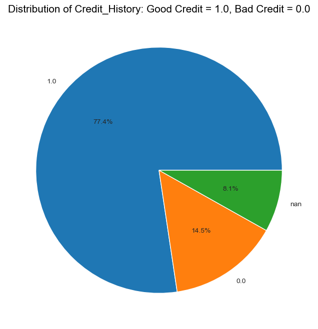
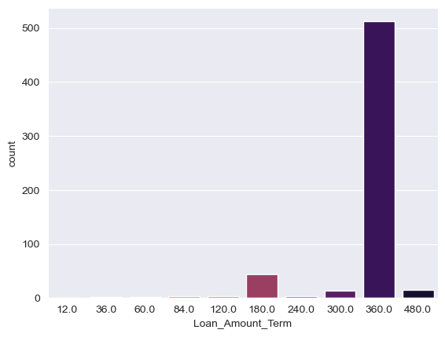

# Bank-Loan-Application
### INTRODUCTION
.
This Bank seeks to automate (in real time) the loan qualifying procedure based on information given by customers while filling out an online application form.\
It is expected that the development of machine learning models that can help the company predict loan approval in accelerating decision-making process for determining whether an applicant is eligible for a loan or not.
The Data Set was Obtained from kaggle data sets.

# DATASET DESCRIPTION

*This dataset has 614 samples with 13 features 
Here is a list of the features in this dataset:

**Loan_ID**:	Loan reference number i.e (unique ID)	LP001002; LP001003; ...\
**Gender**:	Applicant gender (Male or Female)	Male; Female.\
**Married**:	Applicant marital status (Married or not married)	Married; Not Married.\
**Dependents**:	Number of family members	0; 1; 2; 3+.\
**Education**:	Applicant education/qualification (graduate or not graduate)	Graduate; Under Graduate.\
**Self_Employed**:	Applicant employment status (yes for self-employed, no for employed/others)	Yes; No.\
**ApplicantIncome**:	Applicant's monthly salary/income	5849; 4583; ...\
**CoapplicantIncome**:	Additional applicant's monthly salary/income	1508; 2358; ...\
**LoanAmount**:	Loan amount	128; 66; ...\
**Loan_Amount_Term**:	The loan's repayment period (in days)	360; 120; ...\
**Credit_History**:	Records of previous credit history (0: bad credit history, 1: good credit history)	0; 1.\
**Property_Area**:	The location of property (Rural/Semiurban/Urban)	Rural; Semiurban; Urban.\
**Loan_Status**:	Status of loan (Y: accepted, N: not accepted)	Y; N.

# This project intends to answer the following questions:
*What are the various relationship between information filled by loan applicants.\
*influence of this information on applicant's loan status.\
*What model best fits loan application automation process task and it's accuracy level

# Benefit of project
*Help Banks to automate (in real time) the loan qualifying procedure based on information given by customers while filling out an online application form.\
*It will help bank track previous loan status records of customers.

## MODELS EXPLORED
*Logistic Regression\
*K-NeighborsClassifier\
*DecisionTreeClassifier\
*Random Forest Classfier\
*Naive Bayes\
*Support Vector Machine.\
*Gradient Boost.

### EXPLORATORY DATA ANALYSIS OF DATA SET
#Gender 
.

.

There were more male applicants than female while 2.1% of applicants didn't specify gender.

#Marrital Status
.
64.8% of applicants were married while 0.5% of applicants didn't indicate their marital status.

#Education
.
There were clearly more educated applicants than the uneducated.

#property Area
.
Most applicant properties were located at semiurban.

#Loan Status
.
From the data set we can infer that most applicants got their loan request approved.

#Dependents
.
Most applicants had no dependant.

#Self Employed or Employee/Others
.
Most applicant were not self employed.

#Credit History
.
Most applicant had good credit history, while 8.1% did not supply thier credit history.

#Loan Duartion
.
Most applicant opted for 360 days duration.

#Distribution of numerical values in data set
.
This is clearly left skewed and not well distributed.\

This is clearly left skewed and not well distributed.\

Slightly a better distribution though not the best.

#Relationship Between features in data set

#Loan Status vs Applicantsincome

we can notice some outliers, this will affect our model but it will be addressed.

#Loan Amount vs Applicants income

there is a slight positive correlation between applicants income and amount of loan requested for.

#Loan_Amount and Application status

The amount of loan requested by customers does not influence thier application status.

